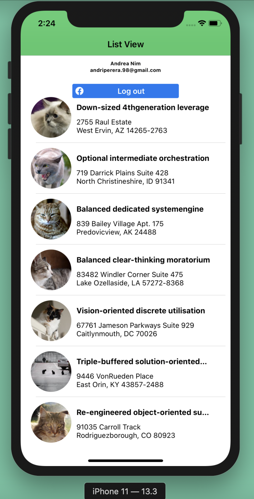
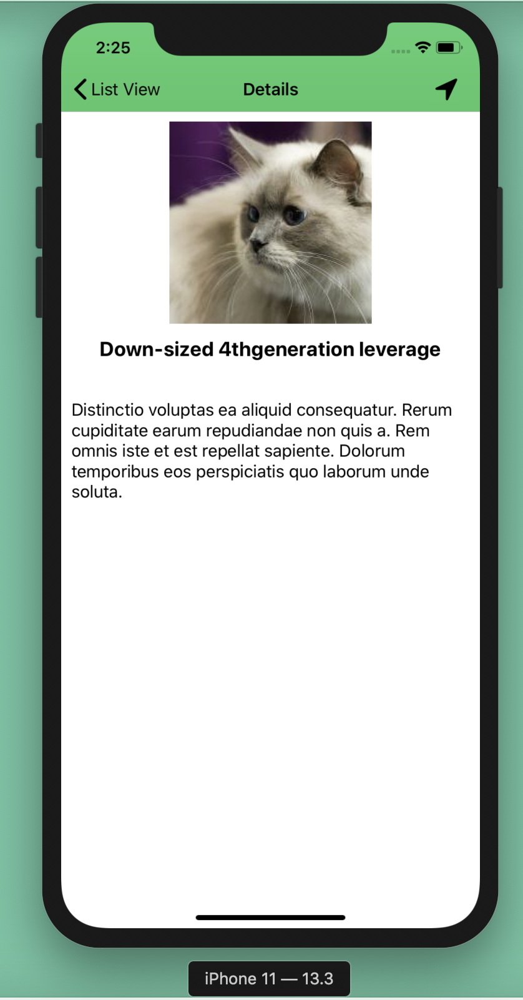
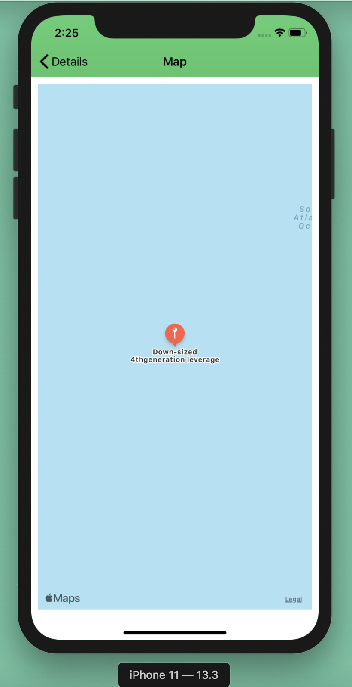

# Demo-App

### Requirements

- Swift
- Xcode - V11.3.1 (11C504)
- iOS 12.0+

The **demo app** has the capability to **login via Facebook**.A table view of hotels data( **Image, Title, Address**) along with a detail view.In addtion to that application contains a **Map view** that contaions the location of the hotel.

### Main Features

- Integrate **Facebook login**.
- Getting **hotels data from a URL** : https://dl.dropboxusercontent.com/s/6nt7fkdt7ck0lue/hotels.json
- Show ** hotel data in a table view** with Image, Title, Address.
- Detail view of hotels.
- **Map view** of the hotel location.

### Application Screens

